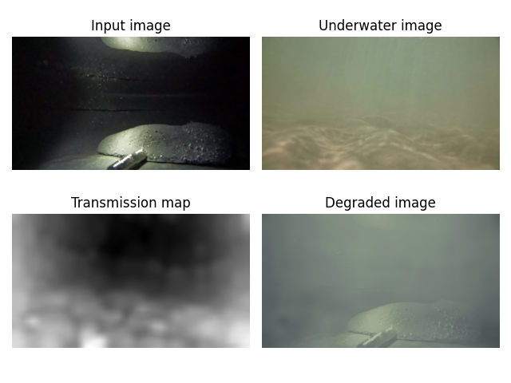

Python implementation of https://ieeexplore.ieee.org/document/9130676 and partly 
https://www.sciencedirect.com/science/article/pii/S1047320314001874 <br>

I am not affiliated with the authors of the papers and I do not claim any rights to the papers.<br>

Usage:
```
python generate.py --input_img path_to_image_you_wish_to_degrade --uw_img path_to_underwater_image --output_dir path_to_output_directory(default is './') --bl_method naive/SUID/RCP(default)
```

Example:<br>

